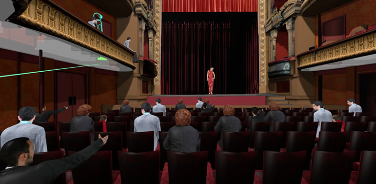
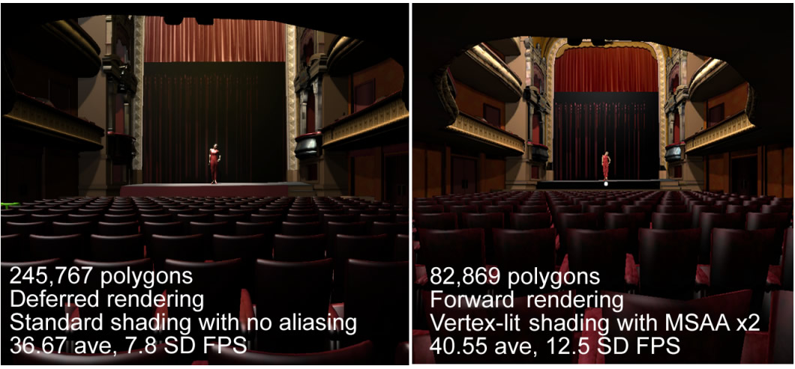
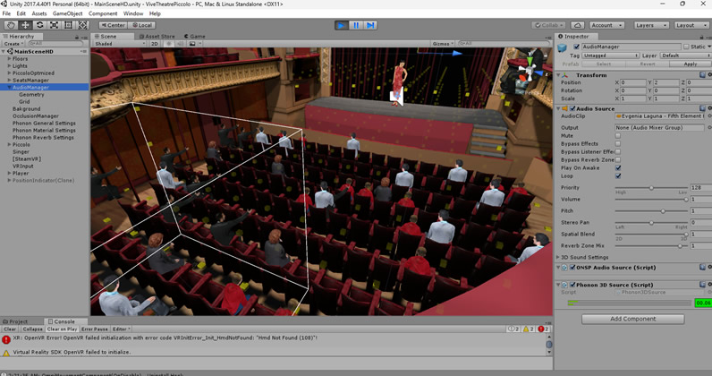

# ViveTheatrePiccolo  

ViveTheatrePiccolo is a virtual digital twin of the Theatre Piccolo located in Chalon-sur-Saône, France. It is a research application designed to study how the sense of immersion and interaction techniques influence the sense off presence and the task of selecting a preferred seat. There are currently two main directions for VR development: PC-based and mobile-based. The capabilities of modern mobile devices in terms of computer graphics have accelerated significantly in the last decade. However, developing VR applications for these kinds of platforms presents important challenges. While newer devices certainly provide more processing power than before, there are limitations regarding the amount of detail that can be rendered, and energy consumption restrictions exist. In contrast, PC-based applications can utilize the full potential of desktop graphics cards to render photorealistic scenes for high-end technologies like Oculus Rift, HTC Vive, or CAVE systems.

We designed an application that allows users to select a seat based on their degree of visual and acoustic comfort. We present subjects with two different virtual environments—high-end and low-end optimized render replicas of the theatre—each designed considering the different capabilities of VR devices (i.e., PC-based HMD vs. mobile-based HMDs). This application allows us to study how differences in visual cues affect the sense of presence and seat preference judgment, based on the sense of immersion induced by the device.

The high-end replica of the theatre requires more than 240,000 vertices, and used deferred rendering with no aliasing. To ensure a smooth experience in a mobile-based HMD, several optimizations were performed. We reduced the number of polygons in the original mesh geometry by approximately threefold to prevent memory overload. To reduce the number of draw calls, we applied static and dynamic batching. For example, the structure was divided into three parts to achieve the appropriate texture aliasing. Additionally, the 350 seats in the theatre were cloned and processed in batches at runtime. In terms of rendering, we used forward rendering with vertex-lit shading for all materials. After applying these changes, we managed to reduce the number of draw passes required and applied multi-sample anti-aliasing (MSAA) x2 to achieve smoother results. We reached a maximum of 79 draw calls and a maximum of 165,000 visible triangles.

To increase the sense of presence, we used binaural, spatialized sound using the Impulsonic Phonon SDK (https://www.impulsonic.com/), a library that simulates physics-based environmental audio. This allows for binaural processing, geometry-based reflections, dynamic reverb, and occlusion based on scene geometry. We designed the application so that subjects would be primarily confronted by visual quality, while auditory differences depended only on the device's sound quality. To select a seat, we used a virtual-wand metaphor with raycasting as the selection technique. This offers a more intuitive interaction by allowing subjects to select the seat by pointing in its direction using the hand-controller device.

## Requirements

1. Unity3D version 2017.

2. HTC Vive V1, HtC Vice Pro or Vive Focus.

3. Nvidia GTX 1060 or later / AMD Radeon RX 480 or later

## Getting Started 

1. Download and install the drivers for your HTC Vive: https://www.vive.com/us/setup/vive-pro-hmd

2. Connect the HTC Vive to your PC, perform the device calibration, and complete the room setup process using SteamVR.

3. Download the project code and open the project in Unity3D. 

4. Download the package [PiccoloHD.unitypackage](https://drive.google.com/file/d/1jD2K7Q9_8n2QwI1cV3srCWSBHhxIUyL_/view?usp=drive_link) and import the package in Unity. It contains the high-detail mesh of the theatre. 

5. Download the zip [PhononBetaBundle.zip](https://drive.google.com/file/d/1Kn1eo4fFq_UZZ2-yjs_pGUEqeW5cGxgr/view?usp=drive_link) and extract the content in the folder Assets/Plugins. It contains the Phonon libraries in its version beta. 

6. There are two scenes 'MainSceneHD.scene' and 'MainSceneLD,scene', each one corresponds to the high-detail and low-detail virtual replicas of the theatre respectively. We recommed using the low-end in mobile-based HMDs. 

7. Before executing the scene, we recommend bake the light in Unity3D with the suggested settings, use Deferred Lighting with no Aliasing for the high-end scene and Forward Rendering with MSSA x2 for the low-end scene. 

8. Open any of the scenes and execute play, put your headset and select your preferred seat just by pointing in its direction with the VR controller and pressing trigger. 

9. That's all!. Compare the experience with different devices and enjoy the opera.  

## Paper

More information about this study and its results can be found in https://ieeexplore.ieee.org/abstract/document/7893351. 

A video of the application used in a CAVE system can be found here: https://www.youtube.com/watch?v=E-5m1K-z5f4

## Credits

Developed by Jose L. Dorado (jl.dorado59@uniandes.edu.co,  jl-dorado@hotmail.com). 

PhD thesis directed by Pablo Figuero (pfiguero@uniandes.edu.co), Jose Tiberio Hernandez (jhernand@uniandes.edu.co), Frederic Merienne (frederic.merienne@ensam.eu), Jean Remmy Chardonnet (jean-remy.chardonnet@ensam.eu)

Copyright 2019 ©Institute Image https://artsetmetiers.fr/en/institut/chalon-sur-saone - Grupo Imagine Uniandes https://imagine.uniandes.edu.co
# ViveTheatrePiccolo